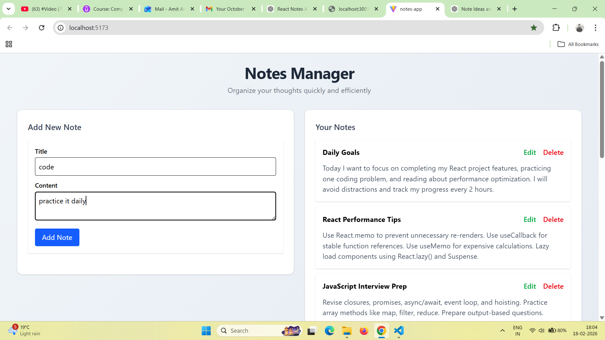
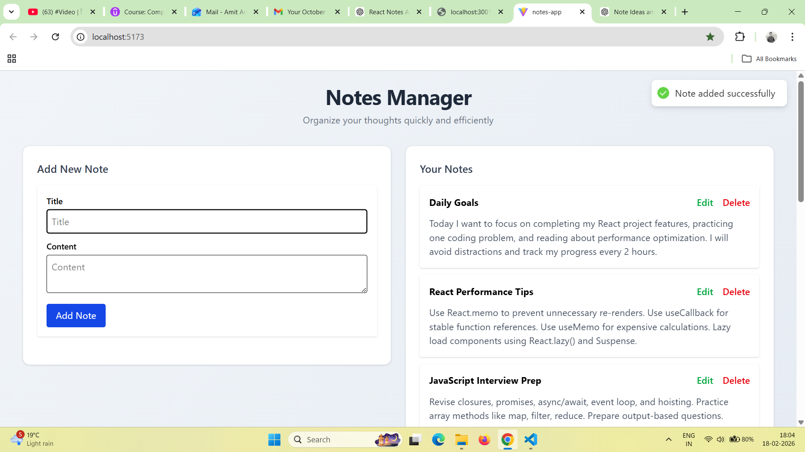
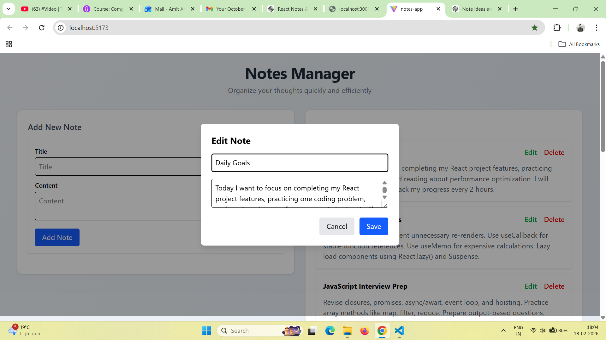
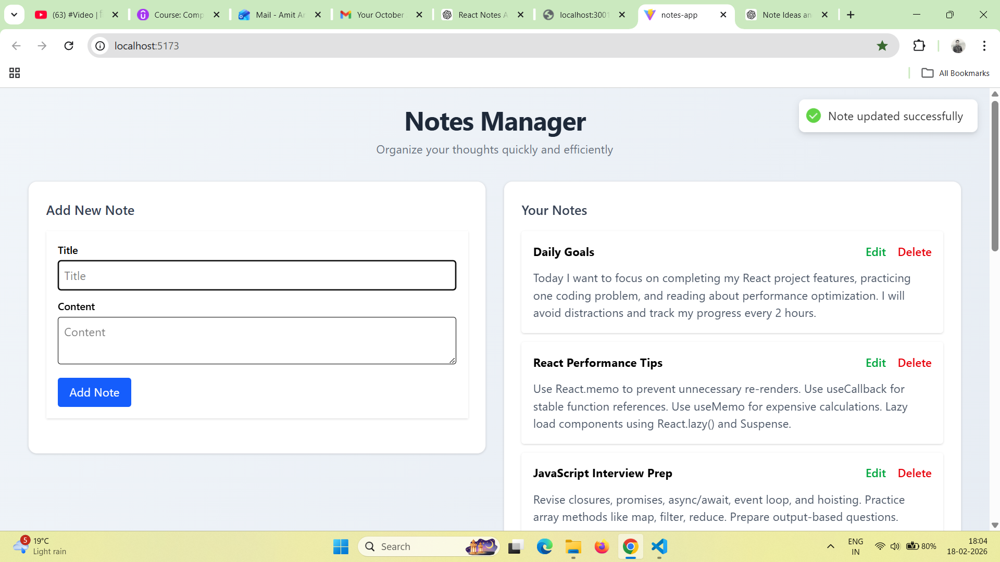
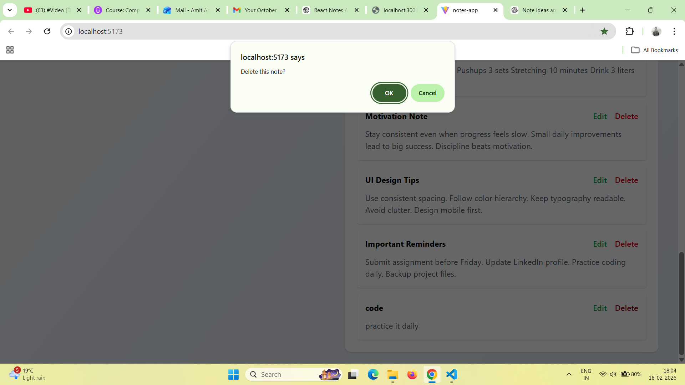
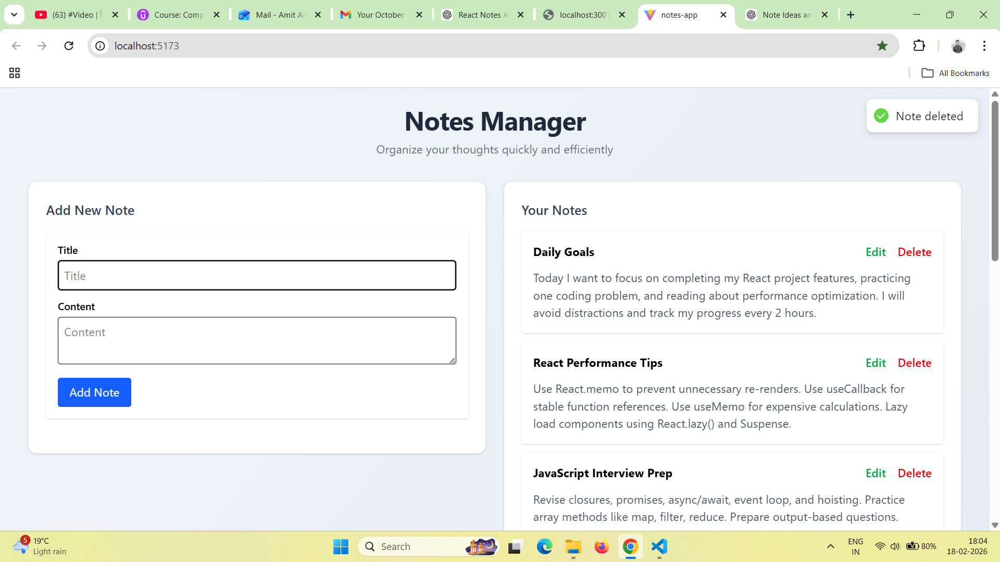

# Notes App — React 19 + Context API + Tailwind CSS + JSON Server

A modern, responsive, and accessible Notes Management application built using **React 19**, **Context API**, **Tailwind CSS**, and **JSON Server** for a mock backend.

This project demonstrates real-world frontend architecture including global state management, CRUD operations, modal UX patterns, focus management, animations, and API integration.

---

## Features

### Core Functionality

* Create notes
* Edit notes (modal popup)
* Delete notes
* Fetch notes from API
* Persistent data via JSON Server

### UI / UX

* Responsive dashboard layout
* Tailwind CSS modern design
* Modal animations (Framer Motion)
* Auto focus management
* Focus restoration after modal close
* Toast notifications (success / error)
* Overlay click + ESC key modal close

###  Performance & Architecture

* Context API global state management
* Optimized component rendering
* Memoized components
* Async API handling
* Centralized focus control

### Accessibility

* Keyboard-friendly modal
* Focus management
* ARIA dialog support

---

##  Tech Stack

| Technology      | Purpose                 |
| --------------- | ----------------------- |
| React 19        | UI library              |
| Context API     | Global state management |
| Tailwind CSS    | Styling                 |
| Framer Motion   | Modal animations        |
| JSON Server     | Mock REST API           |
| React Hot Toast | Notifications           |
| Vite            | Fast development server |

---

##  Project Structure

```
src
│
├── components
│   ├── NoteForm.jsx
│   ├── NotesList.jsx
│   ├── NoteItem.jsx
│   └── EditNoteModal.jsx
│
├── context
│   └── NotesContext.jsx
│
├── App.jsx
├── main.jsx
└── index.css
```

---

## ⚙️ Installation & Setup

### 1️⃣ Clone Repository

```
git clone <your-repo-url>
cd notes-app
```

---

### 2️⃣ Install Dependencies

```
npm install
```

---

### 3️⃣ Install JSON Server (Mock Backend)

```
npm install -g json-server
```

OR

```
npm install json-server
```

---

### 4️⃣ Create Database File

Create `db.json` in project root:

```
{
  "notes": []
}
```

---

### 5️⃣ Start Backend Server

```
json-server --watch db.json --port 3001
```

API endpoint:

```
http://localhost:3001/notes
```

---

### 6️⃣ Start React App

```
npm run dev
```

Open browser:

```
http://localhost:5173
```

---

##  How It Works

### Data Flow

```
JSON Server API
        ↓
NotesContext (Global State)
        ↓
Components (UI)
```

### CRUD Operations

| Action | Method |
| ------ | ------ |
| Fetch  | GET    |
| Create | POST   |
| Update | PUT    |
| Delete | DELETE |

---

## Modal Behavior

* Opens with animation
* Focus moves inside modal
* ESC closes modal
* Click outside closes modal
* Focus restored to form input after close

---

## Advanced UX Implemented

* Automatic input focus
* Focus restoration
* Prevent background interaction
* Loading state during save
* Error handling with toast
* Smooth transitions

---

## Development Scripts

Start React:

```
npm run dev
```

Start JSON Server:

```
json-server --watch db.json --port 3001
```

---

## 🧩 Future Improvements

* Authentication (Firebase / JWT)
* Dark mode
* Search & filter
* Tags & categories
* Drag and drop sorting
* Markdown editor
* Real backend (Node + MongoDB)
* Offline support

---

## 📸 Screenshots

  

  

  

  

  

  


## 📄 License

MIT License

---

## 👨‍💻 Author

Amit Anand
Frontend Developer — React.js

---

## ⭐ If you like this project

Give it a star on GitHub ⭐
